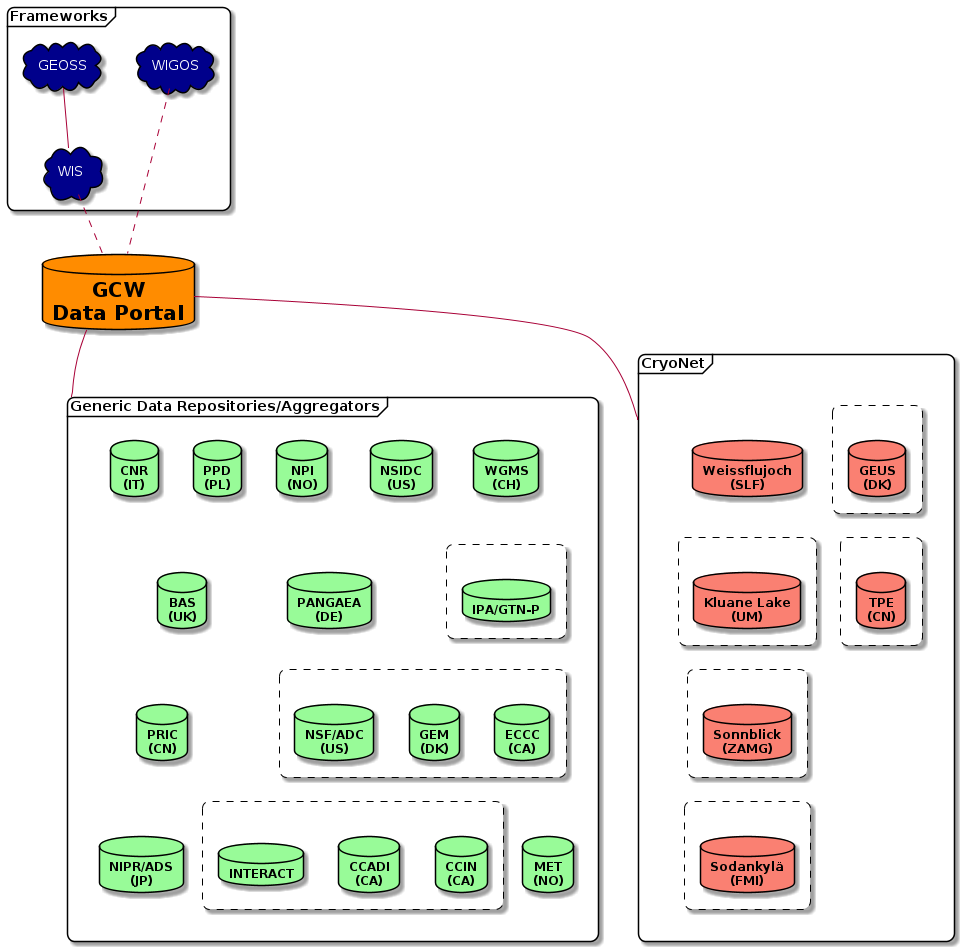
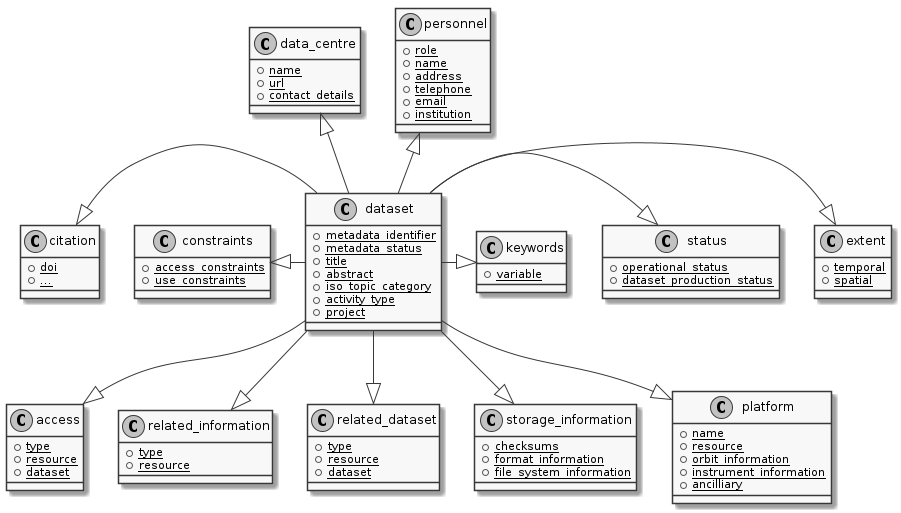
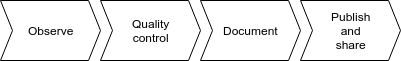

:doctype: article
:pdf-folio-placement: physical
:media: prepress
:sectanchors:
:toc: macro
:toclevels: 6
:sectnums:
:sectnumlevels: 6:
:chapter-label:
:xrefstyle: short
:title-page:
:title-logo-image: image::illustrations/gcw-logo-org.png[]
= Technical documentation: Guidance for data centres contributing to GCW
Date: {docdate}

<<<

[discrete]
== Versions

[cols="1,1,3,1",]
|=======================================================================
|Version |Date |Comment |Responsible

|1.1 |2024-01-xx |Restructured a|Øystein Godøy 
|1.0 |2023-03-03|Restructured and cleaned. Several intermediate versions are merged herein. a| Øystein Godøy
|0.5 |2017-12-31 |A major rewrite with restructuring of the content,
rephrasing requirements and addition of information on both the GCW
Portal and the GCW/SLF software package. a|
Øystein Godøy +
Joel Fiddes
|0.4 |2017-09-06 |Minor edits, correction of typos and addition of
links. a|
Joel Fiddes +
Øystein Godøy
|0.3 |2017-03-27 |Minor edits on OPeNDAP and formats. |Øystein Godøy
|0.2 |2016-06-20 |Included comments from Joel Fiddes. |Joel Fiddes,
Øystein Godøy
|0.1 |2015-11-25 |First draft for internal discussion. |Øystein Godøy
|=======================================================================

<<<

toc::[]

[[introduction]]
== Introduction

[[background]]
=== Background

The intention of the GCW Portal is to be the entry point to datasets describing the cryosphere and form the information basis for the assessment activities of the Global Cryosphere Watch <<gcwwebsite>>. 
It offers a web interface that contains information about datasets through discovery metadata provided by the data providers (or host data centre). 
These discovery metadata are harvested on a regular basis from data centres actually managing the data on behalf of the owners/providers of the data.

The GCW Portal utilises interoperability interfaces to metadata and data in order to provide a unified view on the datasets that are relevant for GCW activities. 
The GCW Portal is also the interface for GCW metadata to WMO Information System (WIS, <<wis>>) and WMO Integrated Global Observing System (WIGOS, <<wigos>>)footnote:[Details on how to avoid duplicate information in WIS and WIGOS needs to be defined. ]. 
The GCW Portal will also facilitate real time access to data through Internet and WMO GTSfootnote:[For datasets not routed through GTS by other agencies.] as requested by the user community. 
This require a certain level of interoperability at the data level in addition to at the metadata level. 
On GTS <<gts>>, WMO formats (BUFR and GRIB) are required and the GCW Portal can transform data into these formats in the dissemination process, provided contributing data centres are following the required standards for documentation and interfaces to data.
There are however formal constraints that have to be solved before the GCW Portal can disseminate data through GTS.

NOTE: WIS 2.0 is replacing WMO GTS with AMQP/MQTT, how GCW will interact with this is under development.

[[scope]]
=== Scope

This document provides an overview of the GCW Portal system and identifies interoperability tools that simplifies integration of data from a number of sources to a unified virtual data management system.
Details of the GCW Data Portal architecture is indicated in <<add>>.

[[intended-audience]]
=== Intended audience

System managers at the data centres contributing to the GCW Portal system are the intended audience of this manual. 
This includes data centres managing CryoNet data as well as other data centres managing cryospheric data. 
Requirements are stricter for data centres managing CryoNet stations data than for other contributing data centres.  
Concerning the roles that should be defined at contributing data centres, the reader is referred to <<add>> and <<opman>>.
The overall plan for implementation is provided in <<implplan>>.

NOTE: <<implplan>> is slightly outdated as of 2023.

[[applicable-documents]]
=== Applicable documents
[horizontal]
[[implplan]]RD 1::
http://www.wmo.int/pages/prog/www/OSY/Meetings/GCW_AM1/GCW_IP_v1.5(1Nov2015).docx[Global Cryosphere Watch (GCW) Implementation Plan, Version 1.5]
[[add]]RD 2::
https://github.com/GlobalCryosphereWatch/ADD[GCW Data Portal - Architecture Overview], pointing at the most recent version
[[opman]]RD 3::
https://github.com/GlobalCryosphereWatch/OM[GCW Portal Operational Manual], pointing at the most recent version
[[gcwwebsite]]RD 4::
http://globalcryospherewatch.org/
[[wis]]RD 5::
http://www.wmo.int/pages/prog/www/WIS/[WMO Information System]
[[gts]]RD 6::
https://public.wmo.int/en/programmes/global-telecommunication-system[WMO GTS]
[[wigos]]RD 7::
https://community.wmo.int/en/activity-areas/WIGOS
[[wmcp]]RD 8::
http://www.wmo.int/pages/prog/www/WIS/metadata_en.html[WMO
Core Profile of the ISO 19115]
[[wmds]]RD 9::
[[anchor-9]]https://www.wmo.int/pages/prog/www/wigos/index_en.html[WIGOS],
including the metadata standard
[[oaipmh]]RD 10::
http://www.openarchives.org/OAI/openarchivesprotocol.html[The Open
Archives Initiative Protocol for Metadata Harvesting, Version 2]
[[oaipmhtools]]RD 11::
https://www.openarchives.org/pmh/tools/tools.php[OAI-PMH tools] 
[[ogccsw]]RD 12::
http://www.opengeospatial.org/standards/cat[OGC CSW specification]
[[gcmddif]]RD 13::
http://gcmd.gsfc.nasa.gov/add/difguide/index.html[GCMD DIF Writers Guide]
[[gcmdkeywords]]RD 14::
http://gcmd.nasa.gov/learn/keyword_list.html[GCMD Science Keywords]
[[cfconventions]]RD 15::
http://cfconventions.org/[Climate and Forecast Conventions]
[[cfstdnames]]RD 16::
http://cfconventions.org/standard-names.html[Climate and Forecast Standard Names]
[[netcdf]]RD 17::
http://www.unidata.ucar.edu/software/netcdf/[NetCDF]
[[cf]]RD 18::
http://cfconventions.org/[Climate and Forecast Conventions]
[[opendap]]RD 19::
http://opendap.org/[OPeNDAP]
[[cdm]]RD20::
http://www.unidata.ucar.edu/software/thredds/current/netcdf-java/CDM/[UNIDATA's
Common Data Model]
[[acdd]]RD 21::
http://wiki.esipfed.org/index.php/Attribute_Convention_for_Data_Discovery_1-3[Attribute Convention for Dataset Discovery]

[[an-outline-of-the-gcw-portal]]
== An outline of the GCW Portal

[[background-1]]
=== Background

The https://gcw.met.no[GCW Data Portal], or catalogue, is dedicated to data management and to providing specific information on datasets. 
The architecture of the GCW Data Portal is outlined in <<add>>.
The data management component is an enabling service in the sense that it identifies relevant datasets and their locations and provides an interface that can be used in the evaluation of GCW data and products. 
The portal will support simple visualization (generation of maps or diagrams like time series) and transformations such as reformatting and re-projection of data, _if the data are served through the appropriate interfaces and forms_.

GCW data management shall integrate datasets and provides access to data and information on past, present, and future cryospheric conditions. 
To achieve these results, the data portal must be attached to real-time and near-real-time data management systems and to data archives. 
While interfacing with existing data management systems, GCW respects partnership and ownership. 
GCW itself will rely on distributed data management technologies and partners (e.g. CryoNet stations) to establish the GCW catalogue. 
This process will create a unified interface to datasets in an otherwise fragmented terrain. 
No information on data (discovery metadata) will be kept in the GCW catalogue without an agreement with the data producer/data owner.

IMPORTANT: The compliance of CryoNet stations in particular to the interoperability guidelines is essential to the success of the data portal.

NOTE: GCW data management follows a metadata driven approach in which datasets are described through discovery metadata exchanged between contributing data centers and the GCW catalogue.

In the GCW context, at least two types of metadata are relevant (see <<the-concept-of-metadata>> for more information on metadata). 
One is “discovery” or index metadata identifying general characteristics of a dataset, including what was measured where and when, potential restrictions on data use, data custodians, and the available interfaces to the actual dataset. 
This is the type of metadata that will be exchanged within GCW. Another type, “use” metadata, is required when a user has accessed a dataset and begins to use it. 
Such metadata typically include a specification of variables, units used, how missing values are encoded, and other details on the contents of the dataset.  
The third type of metadata is interpretation or context metadata for observational data (e.g., data quality, instrumentation used, processing performed, and environmental conditions), which allow data to be interpreted in context. 
The ingested discovery metadata will be harvested from project specific, national, and international catalogues. 
Some examples are given in <<data-centres>>. 
In addition to harvesting existing catalogues, the data management part of the GCW portal will facilitate forms for submission of metadata on datasets not handled by existing catalogues.
Successful exchange of metadata will involve some degree of adaptation of systems on either side. 
However, in order to establish a sustainable system, the number of standards the GCW portal has to support cannot be too many. 
Furthermore, the actual data also has to be standardised to support integration of data among data providers. 
Concerning the search model used for the GCW portal, search for scientific parameters is currently based on the GCMD Science Keywords. 

IMPORTANT: All datasets must be documented in the English language.

[[data-centres, {figure-caption}{counter:refnum}]]
.Data centres which the GCW Portal is harvesting or have discussions with.

[[the-concept-of-metadata]]
=== The concept of metadata

GCW Portal metadata are divided in 4 categories which are briefly described in <<metadata-types>>. 
Among these 4 categories, data providers or supporting data centres are supposed to provide 3 of them. 
Further below in this document, there are recommendations on how to provide these.

NOTE: Where possible the GCW Data Portal will try to link discovery metadata and site metadata, in particular for stations with WMO identifiers.

[[metadata-types]]
.Brief introduction to different types of metadata.
[cols="1,1,2,1",]
|=======================================================================
|Type | Purpose |Description |Examples

|Discovery metadata 
|Used to find relevant data 
|Discovery metadata are also called index metadata and are a digital version of the library index card. 
It describes who did what, where and when, how to access data and potential constraints on the data. 
It shall also link to further information on the data like site metadata. 
GCW is required to expose this information through WMO Information System as well. 
Discovery metadata are thus WIS metadata, although the GCW portal can translate to WIS for those not using WMO standards directly. 
a| ISO19115 +
ISO19115 (WIS) +
GCMD DIF

|Use metadata 
|Used to understand data found 
|Use metadata describe the
actual content of a dataset and how it is encoded. 
The purpose is to enable the user to understand the data without any further communication. 
It describes content of variables using standardised vocabularies, units of variable, encoding of missing values, map projections etc. 
a|Climate and Forecast Convention +
BUFR +
GRIB

|Configuration metadata 
|Used to tune portal services for datasets for users. 
|Configuration metadata are used to improve the services offered through a portal to the user community. 
This can be e.g. how to best visualise a product. 
This information is maintained by the GCW portal and is not covered by discovery or use metadata standards. 
|

|Site metadata 
|Use to understand data found 
|Site metadata are used to describe the context of observational data. 
It describes the location of an observation, the instrumentation, procedures etc. 
To a certain extent it overlaps with discovery metadata, but also extends it. 
Site metadata can be used for observation network design. 
a|WIGOS +
OGC O&M

|=======================================================================

[[types-of-contributing-data-centres]]
=== Types of contributing data centres

[[cryonet]]
==== CryoNet
////
TODO: Rodica would this still be ok or should we use another concept than CryoNet??
////

The GCW surface observation network is comprised of a core component (CryoNet). 
These stations are following GCW measurement practises and have continuous temporal records of a certain length and quality.

Contributing stations are those that provide useful measurements of the cryosphere, but whose data records may be shorter or with large gaps, do not completely follow CryoNet measurement practices, or in some other way do not provide the quality and consistency of data required of CryoNet stations. 
These stations may be in remote, hard to access regions where cryospheric observations are scarce or in regions where they complement other http://globalcryospherewatch.org/about/cryosphere.html[cryospheric
measurements].

CryoNet and contributing stations must expose metadata as well as data in GCW standardised form enabling the GCW Portal to catalogue all datasets, access archived data as well as feed real time data into real time data streams used by the WMO GCW user community.

All http://globalcryospherewatch.org/cryonet/site_types.html[CryoNet and contributing stations] must provide sufficient information to the minimal requirements of WIS <<wis>> and WIGOS <<wigos>> metadata.

[[other]]
==== Other

In addition to the stations listed above, there is a large number of data centres managing relevant datasets. 
In order to identify these datasets, the GCW Portal is harvesting metadata from a number of data centres and filter the information for information about the cryosphere. 
Data centres wishing to contribute to this will also need to follow some minimal requirements concerning interoperability at the metadata and data level.

These requirements are provided below.

[[quick-reference-to-recommended-interfaces-and-standards]]
== Quick reference to recommended interfaces and standards

=== Introduction

The text below provides a brief introduction to standards for interfaces and documentation that GCW data management relies on. 
It is worth noting that GCW is not solely relying on WMO standards as these are not widely used in the scientific community primarily providing data.
In order to establish a manageable system, the number of interfaces has to be a minimum, otherwise the development and maintenance costs of the Portal will be too high and not sustainable. 

Further details on the specific standards are provided below.

=== Quick guide for data centres

[horizontal]
Data discovery level:: In order to integrate your data catalogue with the GCW Portal, an appropriate interface serving discovery metadata in standardised form is required. 
This information should be provided using ISO-19115 with GCMD Science Keywords (<<gcmdkeywords>>) for variables or GCMD DIF (<<gcmddif>>) records through OAI-PMH (<<oaipmh>>). 
It is important that the discovery metadata records contains references (links) to the actual data. 
These links need to be appropriately identified with the protocol in use. See data access for more details.
This discovery information is the only information that will be cached in the GCW Portal.

NOTE: Concerning ISO-19115 metadata, both ISO-19115-1 and ISO-19115-2 is supported.

Data access level:: As noted above the discovery metadata are required to contain references to the actual data. 
The recommended interface for data is OPeNDAP (<<RD-19>>).
This allows streaming of data and direct visualisation/manipulation of data in the GCW portal.
Data can also be served as a blob for download through FTP or HTTP, but this will not be used for visualisation/manipulation of data in the GCW Portal.
Gridded data benefits from OGC WMS representation as well.
The OGC WMS representation has to provide a GetCapabilities document per dataset, a service end point with multiple datasets combined in the same GetCapabilities document will not be consumed.

Data documentation level:: CF-NetCDF  following the CF-1.6 convention or higher (<<RD-15>>) is the recommended format and the only format that will be interpreted by the GCW Portal.
This allows streaming of data and handling of both real time and archived data.
In situ observations must be encoded following the Discrete Sampling geometry of CF.
Further information on how to encode data is provided later in the document and more dedicated for the data provider.

=== Quick guide for data providers

The primary task of data providers (scientists being responsible for the data) is to encode data in CF-NetCDF (<<RD-15>>) using CF-1.6 (sample profiles provided elsewhere in the document) or higher following the discrete sampling geometries for in situ data.

IMPORTANT: In order to ensure that your data is integrated in the GCW Portal, pick a data centre that is compliant with the discovery and data access levels requirements of the GCW Portal.
If such a data centre is lacking, please contact the GCW Data Publication service through the GCW Portal.

[horizontal]
Granularity:: Provide information for each station separate. 
Variables that have conflicting dimension (e.g. different temporal resolution or one variable being a point measurement and another a profile) at a station can be separated into separate datasets.
Do not combine stations in one dataset unless this being a complementary dataset to the individual stations.

CF-NetCDF encoding:: Check out the recommended profiles provided in this document.
////
TODO: Add cross reference...
////

[[interoperability-interfaces]]
== Interoperability requirements

[[discovery-metadata]]
=== Discovery Metadata

[[background-2]]
==== Background

Discovery metadata are generated by the data centres hosting the data sets. 
Metadata are harvested and ingested in the central catalogue for usage by the GCW Portal user community.

The GCW Portal harvest discovery metadata to a central repository that facilitates the search process for users. 
The GCW search is not based on distributed search (forwarding search criteria to supporting catalogues) as this is a slower process compared to searching in a central repository. 
Discovery metadata are harvested at regular intervals and checked for conformance according to the standards identified herein and in <<wis>>.

NOTE: The harvesting process is based on a daily incremental harvest where possible, with a monthly full harvest where existing information is overwritten. 

Regardless of the metadata standard used and the mechanism for transport of the information the following recommendation should be implemented at the data centre repositories.

[[exchange-mechanisms-for-discovery-metadata]]
==== Exchange mechanisms for discovery metadata

[[introduction-1]]
===== Introduction

Discovery metadata must be exposed using a suitable interface that allows information on existing datasets as well as changes to the inventory to be conveyed to the GCW Portal. 
Suitable interfaces for this are currently OAI-PMH <<oaipmh>> and OGC CSW <<ogccsw>>. 
Support for schema.org and DCAT-AP is in progress.
Other interfaces may be evaluated, but to ensure a cost effective solution the number of interfaces must be limited.

OAI-PMH is the recommended interface to use due to its simplicity and cost effective nature. 
A number of software solutions supporting this are freely available and a free and open software package (see <<gcwsoftwarestack>>) will be provided.

[[oai-pmh]]
===== OAI-PMH

The Open Archives Initiatives Protocol for Metadata Harvesting (OAI-PMH, <<oaipmh>>) is the recommended interface for exchanging metadata with the GCW Portal. 
It is a cost effective and robust implementation for exchange of metadata between data centres and was extensively used during the International Polar Year 2006-2008. 
It is much cheaper to implement than most alternatives and there are a number of tools available <<oaipmhtools>>. 
For new implementations https://geonetwork-opensource.org/[GeoNetwork] and https://pycsw.org/[pycsw] are recommended solutions that work pretty well in relation to the GCW Data Portal.

When implementing OAI-PMH there is a number of GCW recommendations (see
<<requirements>>) that are based on experience during the initial
period of metadata exchange for GCW.

NOTE: OAI-PMH serving GCMD DIF is currently the preferred mechanism for interacting with the GCW Data Portal at the discovery metadata level. 
Properly formatted ISO19115 (e.g. the INSPIRE profile) is also supported.

[[ogc-csw]]
===== OGC CSW

The Open Geospatial Consortium Catalogue Services for the Web (OGC CSW, <<ogccsw>>) is another standard for exposing the content of a catalogue in a standardised form. 
As for OAI-PMH records are exposed using XML. 
Compared to OAI-PMH, OGC CSW is a bit more expensive to implement from the specification although there are several tools supporting it (e.g. GeoNetwork and pycsw as mentioned above). 
It is the recommended exchange mechanism for metadata within the European framework INSPIRE and is supported by the GCW Portal although OAI-PMH is recommended from a cost benefit perspective. 
If OGC CSW is used it must provide ISO-19115/ISO-19139 records through GET. 
The keyword element has to be populated with relevant GCMD Science Keywords and the purpose of the keyword has to be identified by attributes. 

NOTE: The GCW Data Portal is harvesting ISO19115/ISO19139 over OGC CSW from a number of data centres. 
There are challenges and e.g. when harvesting from GeoNetwork, but these can be sorted out through a dialogue between the data centre and the GCW Portal.

[[other-1]]
===== Other

Other mechanisms like OpenSearch, schema.org and DCAT-AP are under implementation, but is currently not fully supported. 
CryoNet data centres wishing to test this needs to establish a dialogue with the GCW Portal.

NOTE: Harvesting using schema.org according to ESIP's science on schema org is currently being tested against NSF ADC, CCADI and GEM. 

[[structures-for-discovery-metadata]]
==== Structures for discovery metadata

===== Introduction

The GCW Data Portal is consuming discovery metadata that are describing the data. 
The information model used by the GCW Data Portal is indicated in <<mmd-uml>>. 

This is a conceptual illustration of the model, where elements are grouped at a logical level to indicate purpose.

[[mmd-uml]]
.Conceptual model of the discovery metadata model.

For more details, please check out the MMD specification at https://htmlpreview.github.io/?https://github.com/metno/mmd/blob/master/doc/mmd-specification.html.

<<discovery-model-elements>> below shows the elements of the information model and mappings against ISO19115 and GCMD DIF.
Further mappings are under development.

include::discovery-model-mapping.adoc[]

===== ISO19115

The WMO Core Profile <<wmcp>> is a profile of the ISO-19115 metadata standard and is recommended for use within GCW for discovery metadata. 
However, ISO19115 is a container that can be populated with several controlled vocabularies in some of the elements. 
The search model for the GCW Portal (see above) is currently built around parameter descriptions using the GCMD Science Keywords, <<gcmdkeywords>>. 
A mapping exist between Climate and Forecast standard names, <<cfstdnames>> and GCMD Science Keywordsfootnote:[http://cfconventions.org/faq.html#stdnames_mappings], although this not actively maintained currently. 

NOTE: GCW has a vocabulary server for establishing the necessary mappings in an incremental manner. 
This service is under reimplementation as of early 2023.

NOTE: GCW is actively engaged with WIGOS to establish a dedicated controlled vocabulary for GCW purpose.

NOTE: Need to add information on how to handle controlled vocabularies, both for keywords and for URLs, as well as how to convey information about personnel related to the dataset and the host data centre. 

NOTE: WMO is moving towards OGC API Records as the discovery metadata standard for WIS 2.0.
This is yet not supported for harvesting in the GCW Portal.

===== GCMD DIF

The Global Change Master Directory (GCMD) Directory Interchange Format (DIF), <<gcmddif>> is a metadata standard that is widely used (e.g. by the Antarctic Master Directory) and that was used to establish the International Polar Year Data and Information Service (IPYDIS), hosted by the National Snow and Ice Data Center (NSIDC).

NOTE: The GCW Data Portal consumes DIF versions V9.x and 10.x.

===== Other

Support for ESIP's Science on schema.org is under development.

[[data]]
=== Data encoding and access

==== Background

While interoperability at the metadata level is important for GCW, international exchange of observations of the cryosphere is vital to success of GCW. 
This implies both exchange of archived data as well as exchange of real time information. 
In order to facilitate such exchange of information within the GCW community a certain level of standardisation is required. 
This standardisation is required to ensure that all users can easily understand the data that is made available and perform inter-comparisons as well as use it in analyses.

In this context standardised documentation of data through use metadata as well encoding of the information is required. 
Use metadata can be defined as identification of the variables, their structure (e.g.  spatio-temporal dimensions and mapping to file format), units of variables, encoding of missing values, quality/accuracy estimates, map projection and coordinate reference system etc.

Application of a common data model simplifies integration and inter-comparison of datasets. 
Application of NetCDF, <<netcdf>> as the file format, utilising the Climate and Forecast, <<cfconventions>> convention and serving data through OPeNDAP, <<opendap>> simplifies the issue of integration and combination of data through the Common Data Model, <<cdm>>.

[[exchange-mechanisms-for-data]]
==== Exchange mechanisms for data

[[introduction-2]]
===== Introduction

Traditionally data has been exchanged using FTP in various file formats. 
Modern technology opens up for other mechanisms for transporting data. 
Many technologies share some features, but there are differences in complexity and cost of implementation.

[[httpftp]]
===== HTTP/FTP

This is the easiest manner to support data exchange, but it has limitations for large datasets as well as there is no common data model or standardisation of file formats. 
Often data are served in various ASCII formats that differ from data centre to data centre (or data provider to provider) without any standardised metadata simplifying the process of understanding and using the data. 
Integration of data from various data centres usually takes much human effort. 
This is simplified if standardised formats like WMO BUFR or WMO GRIB are used, but also for these additional information is required to fully understand the content. 
Data in NetCDF following the Climate and Forecast Convention is self explainable and use the Common Data Model.

Segmentation of real time data has to be supported by the contributing data centre. 
FTP is not recommended for GCW purposes, HTTP can be the fallback mechanism, but in order to properly identify the physical files in a time series, more discovery metadata is required than if OPeNDAP is used. 
Anyway, data must be presented in a self explaining format, site or organisation specific formats are not useful.

NOTE: Data served through HTTP/FTP should be referenced as individual links per file in the discovery metadata. 
If data access is through a web page, this must be conveyed in discovery metadata as a project web page. 
The GCW Data Portal can not do anything but referring the user to this web page. 
There is no linkage between data served this way and the operational exchange of data within WMO.

===== OPeNDAP

The Data Access Protocol, <<opendap>> simplifies integration of data from various data centres as it is utilising the Common Data Model, provided input data are encoded according to Climate and Forecast conventions use metadata follows the data and the application of a data stream removes the step of downloading a file and keeping track of this while working on the data. It also allows segmentation of data in variable space and space and time and it is
RESTfulfootnote:[http://apievangelist.com/2014/12/05/history-of-apis-noaa-apis-have-been-restful-for-over-20-years/].

OPeNDAP is the recommended way to exchange data within GCW. 
It allows access to both archived and real time data. 
When OPeNDAP is used, the GCW portal can extract the most recent observations from a time series and ingest these in WMO GTS if required by the user community. 
The data served through OPeNDAP has to be mapped to the Climate and Forecast convention 1.6 or higher. 
Further details on how to encode data in according to this convention is provided in the NetCDF description (see <<CF-NetCDF>>).

Several OPeNDAP implementations exist (e.g.  http://www.unidata.ucar.edu/software/thredds/current/tds/[THREDDS], http://docs.opendap.org/index.php/Hyrax[Hyrax], https://coastwatch.pfeg.noaa.gov/erddap/index.html[ERDDAP] and http://www.pydap.org/[pyDAP]). 
pyDAP can integrate with relational databases. 
Utilisation of OPeNDAP simplifies handling of both archive and real time data as the real time segmentation of data is performed by the client asking for data. 
OPeNDAP also minimises the overhead as no files are moved, the client connects to data streams, reads the necessary data and close the connection.

NOTE: The GCW Data Portal is working to enable extraction of real time data from OPeNDAP served data when these are presented according to the NetCDF Climate and Forecasts Conventions for discrete sampling geometries.

===== OGC WFS

OGC Web Feature Service (WFS) is a mechanism allowing subsetting of information, but it relies on transferring data as files in Geography Markup Language (GML). 
There is no standardised form for use metadata in GML. GML behaves like NetCDF without the Climate and Forecast convention. 
It is a container that can hold anything making it hard to fully decode and exhange the information in a harmonised manner.  

NOTE: OGC WFS is not supported by the GCW Portal, but OGC EDR is under evaluation.

NOTE: To be updated with information about OGC API and WIS 2.0 perspectives.

===== OGC WCS

OGC Web Coverage Service (WCS) is similar to OGC WFS but focus on information representing phenomena that varies in time and space. 
Like WFS it transfers files, but the number of file formats may be extended and support e.g. GML, GeoTIFF, HDF-EOS, NetCDF. 
However, OPeNDAP can serve the purpose of both WFS and WCS at a much lower cost. 

NOTE: The GCW Data Portal does not support OGC WCS.

NOTE: To be updated with information about OGC API and WIS 2.0 perspectives.

===== OGC WMS

OGC Web Mapping Service (WMS) is useful for visualising gridded data. 
It provides a graphical representation of data but no access to data in itself. 

NOTE: The WMS service must provide a GetCapabilities document per dataset, not combining multiple datasets into the same GetCapabilities document for the GCW Portal to be able to consume the OGC WMS service.

The WMS server must support the following map projections (to enable consistency between data providers):

1.  EPSG:32661: WGS 84 / UPS North
2.  EPSG:4326: WGS 84
3.  EPSG:3408: NSIDC EASE-Grid North
4.  EPSG:3410: NSIDC EASE-Grid Global

==== File formats

===== Introduction

Most of the exchange mechanisms mentioned above transfer files. 
In order to properly understand the content of a file some use metadata is usually necessary. 
File formats that embed use metadata (and also discovery metadata) are preferred. 
NetCDF in itself is not self describing, but NetCDF following the Climate and Forecast Convention (CF) is self describing. 
Adding the NetCDF Attribute Convention for Dataset Discovery embeds full discovery metadata (e.g. originator/PI, constraints etc.) in the file. 

NOTE: The NetCDF/CF format is strongly recommended in most cases due to widespread use in the scientific community, ease of implementation and utilisation of a clear and consistent data model allowing integration of data across providers. 

Some data may not fit into the model of NetCDF, but with the CF 1.8 (or higher) convention there is now support for standardised descriptions of gridded data (including satellite swath data), time series at stations, time series of profiles at stations, timeseries at moving stations (trajectories) and geometries which formerly was kept in KML, ESRI Shapefiles or similar. 
The NetCDF container is thus providing a standardised encoding for most of the data GCW is concerned with as long as the CF convention version 1.8 or higher is used.

===== WMO BUFR

Binary Universal Form for the Representation of meteorological data (BUFR) is a binary data format maintained by WMO. 
Its main purpose is operational exchange of real time data and it is adapted for robust transfer on varying bandwidth connections. 
Data that are supposed to be exchanged using WMO Global Telecommunication System (GTS) must be encoded in WMO BUFR. 
BUFR is a table driven file format, implying that the format is not self explaining and the user has to have the correct table to understand the content.

When CryoNet sites are providing observational data according to the NetCDF/CF convention over OPeNDAP, the GCW Portal will, if requested, create BUFR files and submit these onto GTS if required by the GCW Community.footnote:[provided data come in a harmonised form (i.e. CF-NetCDF according to the discrete sampling geometries) and there is a BUFR template for the data in question.] 
Furthermore, currently the GCW Portal converts GTS circulated BUFR to CF-NetCDF, this functionality of moving between NetCDF and BUFR will be extended and incorporated as a transformation service in the GCW Portal as well.

===== WMO Grib

GRIdded Binary (GRIB) is a binary format maintained by WMO. 
As BUFR, this format is best suited for real time exchange over WMO GTS. 
It is also a table driven format like BUFR, having the same limitations. 

Depending on the type of data provided, GCW Data Portal may help converting to/from CF-NetCDF and WMO GRIB.

===== CF-NetCDF

This ensures a self explaining dataset where structure and content are encoded using an accepted standard that has impact beyond the original community. 
It can be used to handle gridded data, time series, profiles and trajectories in standardised manner if encoded according to Climate and Forecast conventions (<<cfconventions>>). 
Furthermore, it includes semantics in a manner which can be used to cross walk content with other structured data descriptions.

Usage of NetCDF/CF version 1.6 or higher is recommended for gridded and observational data. 
If outline data are handled, version 1.8 or higher is recommended. 
It is also recommended to add ACDD (<<acdd>>) global attributes to the CF-NetCDF files in order to incorporate the discovery metadata in the actual data.  

NOTE: For details on ACDD elements to add please check out the guidance available at https://adc.met.no/node/4[Arctic Data Centre].

NOTE: For observations, the GCW Data Portal provides services on top of NetCDF-CF when data are encoded in accordance with the Discrete sampling geometries specification and is served through OPeNDAP.

There is an ongoing activity within WMO to establish WMO profiles of NetCDF-CF and GCW is supporting and relying on this. 
If help is required to transform observations in non standard file formats like text or spreadsheets to NetCDF-CF please contact the GCW Data Portal.

NOTE: The GCW Open Source Software Stack, <<gcwsoftwarestack>> will support conversion of data to CF-NetCDF. 
Work is in progress to offer this as a web service.

Specific CF-NetCDF profiles for GCW is provided in <<cfprofiles>>.

===== JSON/GeoJSON

JavaScript Object Notation (JSON) and the geographical extension of this is similar to NetCDF in that it is a container lacking standardised metadata. 
The consequence is that combination of data from various sources is not straightforward.  

NOTE: JSON/GeoJSON is currently not supported by the GCW Portal, but do expect to support GeoJSON at some time in the future provided a sound data model along the lines of the Climate and Forecast Conventions with ACDD can be established.

////
This will probably be part of WIS 2.0, so will come at some point. Will need to update the document.
////

===== XML

Extensible Markup Language (XML) is similar to NetCDF in that it is a container lacking standardised metadata describing its contents. 
There are many variants of XML and the overhead is large. 
The consequence is that combination of data from various sources is not straightforward.

NOTE: XML is not supported by the GCW Portal.

===== CSV

CSV (comma separated files) is often used to exchange data within certain communities.
This is a container like the ones mentioned above that doesn't enforce standardised structures which services could be built on top and is thus not supported. 
The GCW Portal is not handling CSV files as input data, except through the GCW Data Publication Service.

NOTE: Although the GCW Data Portal cannot consume CSV files, the data portal has functionality to dump data from CF-NetCDF into CSV files to simplify the data consumption.

[[gcwsoftwarestack]]
=== The GCW/SLF Open Source Software Package

[[background-4]]
==== Background
////
TODO: Need to review and update links...
////

WMO Global Cryosphere Watch (GCW) is depending on a number of observing stations (CryoNet stations) for feeding the GCW value chain with observations. GCW has a requirement for both real time and archived data. 
In the period 2015-2017, GCW has been working with WSL/SLF to set up interoperability between the WSL/SLF data centre being responsible for one of the CryoNet stations. 
WSL/SLF has kindly agreed to make the software stack they have developed available for a wider community.
This software is also the engine in the GCW Data Publication Service which supports data providers not capable of documenting and publishing their data according to the requirements of GCW.

The following is a brief description of several software tool used at the https://www.wsl.ch/en/about-wsl/locations/slf-davos/[WSL Institute for Snow and Avalanche Research (SLF)] to processes and manage data at various stages of the “datacycle” from sensors to published dataset. 
All projects are available under open source licenses.

The software package is designed to support the value chain provided in
<<cryonet-value-chain>>.

[[cryonet-value-chain]]
.The GCW CryoNet value chain.

[[overview]]
==== Overview

The GCW/SLF software package consists of several modules. 

The core element in the software package is the data preprocessor MeteoIO that takes data from the sensor, through a quality control procedure into standardised NetCDF/CF files which can be published.

MeteoIO was originally developed to provide robust meteorological forcing data to an operational model that forms part of the avalanche forecast at the SLF. 
However, it also happens to be very good at reading diverse data sources and producing a standardised output. 
It has a modular architecture which makes it flexible and fast to develop new use cases. 
It can handle both gridded and time series data and has various functions for cleaning/ processing data to various quality standards and produces QA reports. MeteoIO is C++ library.

MeteoIO git: https://models.slf.ch/p/meteoio/

[[requirements]]
== Requirements
////
TODO: To move to a SRD??
////

The following chapter is listing a number of requirements related to the information provided above. 
In the long term this information may be extracted into a separate document, but in order to simplify the process it is listed herein for now.

[horizontal]
[[req1]]Requirement 1:: All datasets *should* have a unique identifier. 
This is used to track datasets in the central repository and check for duplicates. 
The identifier is set by the authoritative source for the dataset.
Requirement 2:: <<req1>> implies that GCW Data Portal *must* not specify or change a unique identifier unless the dataset is hosted by the GCW Data Portal. 
Requirement 3::  OAI-PMH *should* be used for exchange of discovery metadata.
Requirement 4::  OAI-PMH version 2 *must* be used if OAI-PMH is used for exchange of discovery metadata..  
Requirement 5::  When implementing OAI-PMH for large repositories containing much more than GCW relevant data, configuration of a dedicated cryosphere or GCW set *should* be supported as this reduce the load on the GCW Portal which otherwise has to perform filtering of all harvested metadata. The name of the set that GCW should harvest has to be communicated and names like “GCW” or “Cryosphere” is recommended. More information is available in http://www.openarchives.org/OAI/openarchivesprotocol.html#Set[OAI-PMH Set specification].
Requirement 6::  When records are deleted in the contributing data centres catalogues, information on this has to be communicated to the central catalogue. 
In order to achieve this OAI-PMH identifies the support for deleted records this through the _deletedRecord_ element retrieved in the Identify request. 
Valid responses are no, persistent and transient.  GCW contributing data centres *must* support _transient_ and must maintain transient records for at least 1 monthfootnote:[This may change.]. 
More information on this feature is available in http://www.openarchives.org/OAI/openarchivesprotocol.html#DeletedRecords[OAI-PMH specification of deleted records].
Requirement 7::  The OAI-PMH interface by default offers discovery metadata in Dublin Core. 
This is insufficient for GCW purposes. Discovery metadata *must* be offered in ISO19115 and/or GCMD DIF. 
Details on these specifications are provided below. In order to properly identify the metadata standards in the responses provided by the OAI-PMH end point, it is recommended to use the following keywords: “dif” for GCMD DIF, “iso” for ISO19115 minimum profile, “wis” for the WMO Core Profile of ISO19115 and “wigos” for WIGOS metadata in the “ListMetadataFormats” response. 
The latter is yet not fully defined in XML.
Requirement 8::  CryoNet stations *must* provide WIS and WIGOS metadatafootnote:[In the current situation details on these standards should be discussed between the GCW Portal and CryoNet data centres. ]. 
Requirement 9::  Discovery metadata *must* be available in the English language.
Requirement 10:: OGC CSW version 2.0.2 *must* be used if OGC CSW is used for exchange of discovery metadata.
Requirement 11:: If OGC CSW is used for exchange of discovery metadata, the implementation *must* support HTTP GET (key, value in URL).
Requirement 12:: OGC CSW requests **must **not be embedded in messaging frameworks like SOAP. This will not be supported by the GCW Portal.
Requirement 13:: ISO19115 records *must* at least state the unique id, temporal and spatial location, scientific content, responsible data centre and PI as well as links to the actual datafootnote:[This recommendation will be revisited.].
Requirement 14:: ISO19115 records, regardless of whether being mandatory elements or the full WMO Profile *must* contain GCMD Science Keywords describing the parameters provided in the data.
Requirement 15:: CryoNet and contributing stations **must **have at least have one keyword from the WMO CategoryCode list (#Reference missing#)footnote:[There is currently no way of including this information in GCMD DIF, although a mapping to ISO TopicCategories may be used. ]. 
Relevant keywords for GCW are e.g. weatherObservations, meteorology, hydrology, climatology, glaciology.
Requirement 16:: All times *must* be encoded as ISO8601 in the form YYYY-MM-DDTHH:MM:SS and in UTC.
Requirement 17:: GCMD comes with a number of predefined controlled vocabularies that should be used in specific sections of the metadata. 
As indicated above some sections are free text in GCMD while it is suggested to use controlled vocabularies in GCW contextfootnote:[These vocabularies has to be developed by the GCW community through the Terminology Team. ].
Requirement 18:: GCMD do not require a controlled vocabulary for the quality element.
GCW records *should* to improve search resultsfootnote:[This work should
relate to international activities in this field in the context of e.g.
GEO, ICES, WMO etc. and must be coordinated within GCW by the
Terminology Team. ].
Requirement 19:: Within GCMD DIF Related_URL has several subtypes. 
The existing http://gcmdservices.gsfc.nasa.gov/static/kms/rucontenttype/rucontenttype.csv[list of type and subtype] *must* be used to allow the GCW Portal to filter the purpose of the URLs provided. 
When types are “View Data Set Landing Page”, “View Extended Metadata”, “View Professional Home Page”, and “View Project Home Page”, no subtype is needed.
Requirement 20:: OPeNDAP *should* be supported for data access. 
Data *should* be encoded according to the Climate and Forecast Convention version 1.6 or higher including the featureType attribute to identify gridded data versus time series, profiles or trajectories.
Requirement 21:: OGC WFS and OGC WCS *should* not be used for data exchange.
Requirement 22:: NetCDF following the Climate and Forecast Convention with NetCDF Attribute Convention for Dataset Discovery **should **be used as file
format.

[appendix]
== GCW CF-NetCDF profiles

=== Background

The Climate and Forecast Conventions provides guidance on how to use the NetCDF file format in a consistent and self describing manner.
However, following the CF conventions there are meny degrees of freedom on how to encode data.
In this chapter GCW provides recommendations on how to use the CF conventions for various types of data.
In addition a chapter is dedicated to ACDD elements that allows GCW to generate discovery metadata directly from the datasets, e.g. in the context of the GCW Data Publication Service.

Granularity is important considering efficient reuse of data. 
In this context more flexibility for data consumers is retained if stations are submitted stand alone instead of bundled in one file.

=== ACDD

include::acdd.adoc[]

=== A weather station

=== A permafrost station
